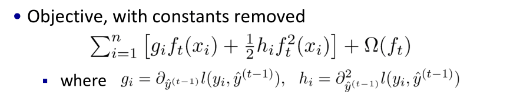
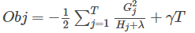
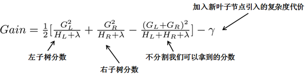
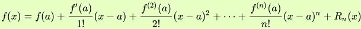

 Xgboost在面试中被问到过很多次，因为没有实践过，只有一些浅显的理论理解。

<!--more-->

###  核心算法思想

1. 不断地添加树，不断地进行特征分裂来生长一棵树，每次添加一个树，其实是学习一个新函数**f(x)**，去拟合上次预测的**残差**（ **A的实际值 - A的预测值 = A的残差** ）。
2. 当我们训练完成得到k棵树，我们要预测一个样本的分数，其实就是根据这个样本的特征，在每棵树中会落到对应的一个叶子节点，每个叶子节点就对应一个分数
3. 最后只需要将每棵树对应的分数加起来就是该样本的预测值。

###  目标函数

事实上，如果不考虑工程实现、解决问题上的一些差异，xgboost与gbdt比较大的不同就是目标函数的定义。 

 目标函数分为两部分：**损失函数和正则化项**。   **损失函数揭示训练误差，正则化定义复杂度** 

- 损失函数

​		 考虑到我们的第t 颗回归树是根据前面的t-1颗回归树的残差得来的，相当于t-1颗树的值yi^(t-1)是已知的。换句话说，L(yi,yi^(t-1))对目标函数的优化不影响，可以直接去掉，且常数项也可以移除，从而得到如下一个比较统一的目标函数。 

​	**目标函数只依赖于每个数据点在误差函数上的一阶导数和二阶导数 **

- 正则项

  xgboost对树的复杂度包含了两个部分：

  1. 一个是树里面叶子节点的个数T
  2. 一个是树上叶子节点的得分w的L2模平方（对w进行L2正则化）

###  打分函数

- 分裂节点

  -  枚举所有不同树结构的贪心法 

     **先按照该特征里的值进行排序，然后线性扫描该特征进而确定最好的分割点**，最后对所有特征进行分割后，我们选择所谓的增益Gain最高的那个特征 。

    

  - 近似算法（ 针对数据太大，不能直接进行计算 ）

   总而言之，XGBoost使用了和CART回归树一样的想法，利用贪婪算法，遍历所有特征的所有特征划分点，不同的是使用的目标函数不一样。具体做法就是分裂后的目标函数值比单子叶子节点的目标函数的增益，同时为了限制树生长过深，还加了个阈值，只有当增益大于该阈值才进行分裂。 

###  Xgboost与GBDT的不同

- GBDT是机器学习算法，XGBoost是该算法的工程实现。
- 在使用CART作为基分类器时，XGBoost显式地加入了**正则项**来控制模型的复杂度，有利于防止过拟合，从而提高模型的泛化能力。
- GBDT在模型训练时只使用了代价函数的**一阶导数**信息，XGBoost对代 价函数进行**二阶泰勒展开**，可以同时使用**一阶和二阶导数**。
- 传统的GBDT采用**CART**作为基分类器，XGBoost支持多种类型的基分类 器，比如线性分类器。
- 传统的GBDT在每轮迭代时使用全部的数据，XGBoost则采用了与随机森林相似的策略，支持对数据进行采样。
- 传统的GBDT没有设计对缺失值进行处理，XGBoost能够自动学习出缺失值的处理策略。

###  为什么XGBoost要用泰勒展开，优势在哪里？

 XGBoost使用了一阶和二阶偏导, 二阶导数有利于梯度下降的更快更准。使用泰勒展开取得函数做自变量的二阶导数形式，可以在不选定损失函数具体形式的情况下，仅仅依靠输入数据的值就可以进行叶子分裂优化计算，本质上也就把损失函数的选取和模型算法优化/参数选择分开了。这种去耦合增加了XGBoost的适用性，使得它按需选取损失函数，可以用于分类，也可以用于回归。 

###  其他

泰勒公式：

 其中的多项式称为函数在a 处的泰勒展开式，剩余的Rn(x)是泰勒公式的余项，是(x-a)^n的高阶无穷小 

- 参考

  [通俗理解kaggle比赛大杀器xgboost](https://blog.csdn.net/v_JULY_v/article/details/81410574)

  [【机器学习】决策树（下）——XGBoost、LightGBM（非常详细）](https://zhuanlan.zhihu.com/p/87885678)

