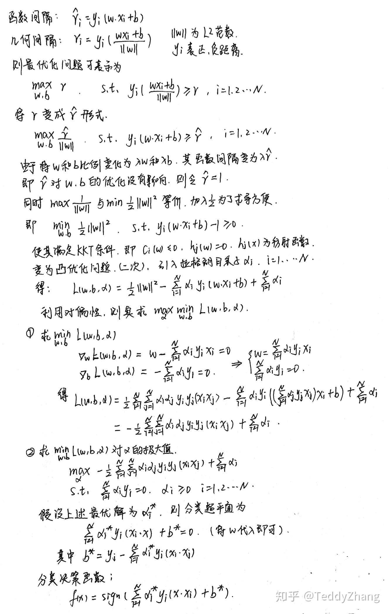
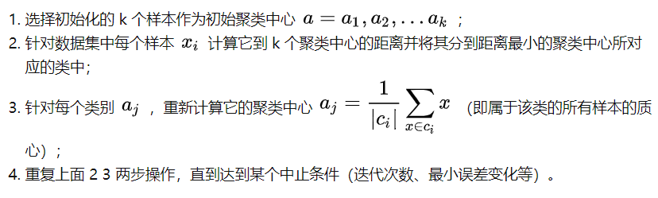

本文整理了常用的机器学习算法以备面试。

<!--more-->

### 逻辑回归

- 逻辑回归的基本假设：假设数据服从**伯努利分布**，以p概率取1，1-p概率取0，这样的模型就是逻辑斯蒂回归模型

- 逻辑回归的损失函数：最大化对数似然， 使用**梯度下降法**来不断逼近最优解。

- **为什么要用最大似然估计？**

  - 从求最优解的角度：用最小二乘的目标函数是非凸的，容易**局部最优**，而对数似然函数是一个凸函数，可以用梯度下降法来求解。
  - 收敛速度：最小二乘的收敛速度慢，最大似然收敛快

  类似的问题：[线性回归为什么用最小二乘？](https://blog.csdn.net/saltriver/article/details/57544704)

   最小二乘法以估计值与观测值的平方和作为损失函数，在误差服从正态分布的前提下，与极大似然估计的思想在本质上是相同。 
  
- LR的优缺点

  - 优点：结构简单，可解释性强，训练速度快
  - 缺点：很难拟合数据的真实分布，很难处理数据不平衡的问题，处理非线性数据比较麻烦。

- LR和SVM的区别：

  - 损失不同
  
  - LR是**参数模型**，SVM是非参数模型。 参数模型和非参数模型中的“参数”并不是模型中的参数，而是数据分布的参数。
  
    - 参数模型和非参数模型
  
      ​	参数机器学习模型由于指定了目标函数的形式，所以可以极大地简化这个学习的过程，但是同样会限制学习的过程。所以参数机器学习模型包括两个部分：1、选择合适的目标函数的形式。2、通过训练数据学习目标函数的参数。 
      
       非参数机器学习算法对目标函数形式不做过多的假设，因此算法可以通过对训练数据进行拟合而学习出某种形式的函数。 常见的非参数机器学习模型包括：决策树，朴素贝叶斯，SVM，神经网络。
  
  
  - SVM不直接依赖数据分布，而LR则依赖，因为SVM只与支持向量那几个点有关系，而LR和所有点都有关系。 
  - LR是经验风险最小化模型（极大似然估计），SVM是结构风险最小化模型（等价于加了正则化）
  

###  SVM 

SVM简单来说，对于线性可分的数据，最大化一个硬间隔支持向量机，近似可分时，最大化软间隔支持向量机，线性不可分时，使用**核技巧**学习非线性支持向量机。

- 函数间隔和几何间隔

  函数间隔受参数w影响，几何间隔除以L2范数，是确定的

- 对偶问题

  对偶问题更容易求解，把目标函数和约束融为拉格朗日函数，通过这个函数来寻找最优解。

  可以自然的引出核函数，进而推广到非线性分类问题

- 引入核函数

  原本的样本空间线性不可分，通过核函数把样本映射到一个线性可分的空间去，这样以后，求解对偶问题只需知道核函数，求解难度下降。

- 核函数之间的区别

  线性核：适用于线性可分，参数少，训练快

  高斯核：适用于线性不可分，参数多，分类结果依赖于参数的好坏

  

- 手推SVM

  

###   朴素贝叶斯

定义：对于给定的训练数据集，首先基于特征条件独立假设学习输入/输出的**联合概率**分布，然后基于该模型，对于给定的输入x，利用贝叶斯定理求出**后验概率**最大的输出y。

- 为什么**朴素**？ 在计算P(X|Y)时引入了很强的特征独立，这样做可以避免求解时面临的组合爆炸和样本稀疏问题。 

- 优点： 对小规模的数据表现很好，适合多分类任务，适合增量式训练。收敛快。 
- 缺点： 对输入数据的表达形式很敏感（离散、连续，值极大极小之类的）。 条件独立性假设。

###  KNN

- 算法原理：采用测量不同特征值间的距离或相似度的方法进行分类。如果一个样本在特征空间的K个最相似（最近邻）的样本中的大多数属于某个类别，则该样本也属于该类别。

- 算法决策过程：
  - 计算新数据与训练集中的特征相似度或距离
  - 取TopK个最近邻的数据分类的标签
  - TopK中出现最多的作为最终的分类标签
- K的取值
  - k值小：过拟合 噪声敏感
  - k值大：欠拟合 
- 进阶：kd树

###  K-means

 K-Means的一个重要的假设是：**数据之间的相似度可以使用欧氏距离度量**，
（注：**可以使用欧氏距离度量**的意思就是欧氏距离越小，两个数据相似度越高） 

- 算法步骤：
  
- 
  
- 优点

  - 容易理解，聚类效果不错，虽然是局部最优（EM算法容易陷入局部最小值）， 但往往局部最优就够了；
  - 处理大数据集的时候，该算法可以保证较好的伸缩性；
  - 当簇近似高斯分布的时候，效果非常不错；
  - 算法复杂度低。

- 缺点

  - K 值需要人为设定，不同 K 值得到的结果不一样；
  - 对初始的簇中心敏感，不同选取方式会得到不同结果；
  - 对异常值敏感；
  - 样本只能归为一类，不适合多分类任务；
  - 不适合太离散的分类、样本类别不平衡的分类、非凸形状的分类。

- 改进

  - 数据预处理，去除异常点（数据归一化）

  - 合理选择K值（手肘法）

  -  基于欧式距离的 K-means 假设了了各个数据簇的数据具有一样的的先验概率并呈现球形分布，但这种分布在实际生活中并不常见。 

    采用**核函数**， 主要思想是通过一个非线性映射，将输入空间中的数据点映射到高位的特征空间中，并在新的特征空间中进行聚类。 
    
  - 二分k-means

- 基础版K-means代码

```python
import numpy as np
import math


def calDistance(vecA, vecB):  # 欧式距离
    return sum((vecA - vecB) ** 2) ** 0.5


def initCentroids(dataSet, k):
    numSamples, dim = dataSet.shape
    centroids = np.zeros((k, dim))
    for i in range(k):
        index = int(np.random.uniform(0, numSamples))
        centroids[i, :] = dataSet[index, :]
    return centroids


def kmeans(dataSet, k):
    numSamples = dataSet.shape[0]
    # first column stores which cluster this sample belongs to,
    # second column stores the error between this sample and its centroid
    clusterAssment = np.mat(np.zeros((numSamples, 2)))  # np.mat 仅仅是生成矩阵 # 相当于np.matrix
    clusterChanged = True

    ## step 1: 创建k个点作为起始质心
    centroids = initCentroids(dataSet, k)

    while clusterChanged:
        clusterChanged = False
        ## 对每个样本点
        for i in range(numSamples):
            minDist = np.inf
            minIndex = 0
            ## step 2: 对每个质心
            for j in range(k):
                distance = calDistance(centroids[j, :], dataSet[i, :])
                if distance < minDist:
                    minDist = distance
                    minIndex = j

            ## step 3: 将数据点分配到距其最近的簇
            if clusterAssment[i, 0] != minIndex:
                clusterChanged = True
                clusterAssment[i, :] = minIndex, minDist ** 2

        ## step 4: 更新质心
        for j in range(k):
            pointsInCluster = dataSet[np.nonzero(clusterAssment[:, 0] == j)[0]]
            centroids[j, :] = np.mean(pointsInCluster, axis=0)  # 把每个簇中的所有点的均值作为新的质心
```


###  决策树

- 几个基本概念：
  - 熵：表示随机变量不确定性的度量H(X)
  - 条件熵：已知随机变量X的条件下随机变量Y的不确定性H(Y|X)
  - 信息增益：表示得知特征X的信息而使得类Y的信息的不确定性减少的程度g(D) = H(D)-H(D|A)

- 决策树生成的经典算法：ID3和C4.5 分别按照信息增益和信息增益比来选择特征

- 决策树的剪枝

- CART算法

  CART是给定输入随机变量X条件下输出随机变量Y的条件概率分布的学习方法。

  它假设决策树是二叉树。 CART树的生成就是递归地构建二叉决策树的过程。对回归树用平方误差最小化准则，对分类树用基尼指数最小化准则，进行特征选择，生成二叉树。 

  
### 随机森林 

[Random Forest、Adaboost、GBDT](https://zhuanlan.zhihu.com/p/86263786)

   用随机的方式建立一个森林。RF 算法由很多决策树组成，每一棵决策树之间没有关联。建立完森林后，当有新样本进入时，每棵决策树都会分别进行判断，然后基于投票法给出分类结果。 

